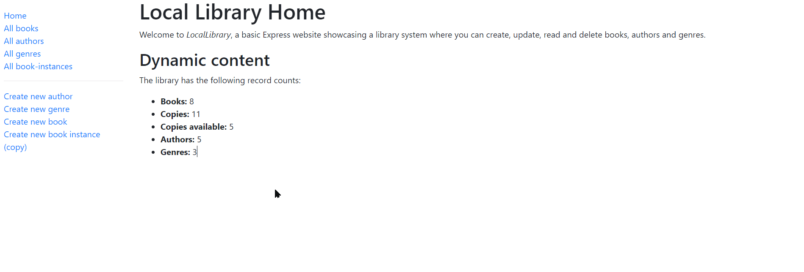

# Express Library System
## Description
A simple library system using CRUD operations to manage authors, books, bookinstances and genres. 

## Technologies Used
Node.js/Express, Javascript, Pug, MongoDB/Mongoose

## Getting started
### Accessing the project
1. Go to this link, where the project is hosted: https://library-system-express.glitch.me/

## Project showcase

### Performing operations
1. Create and read: Use the lefthand navigational links to see a list of the different elements, or create a new element
2. Update and delete: To update or delete an element, go into the list of that element(such as books), select the element and click the delete or update element link in the bottom of the page
